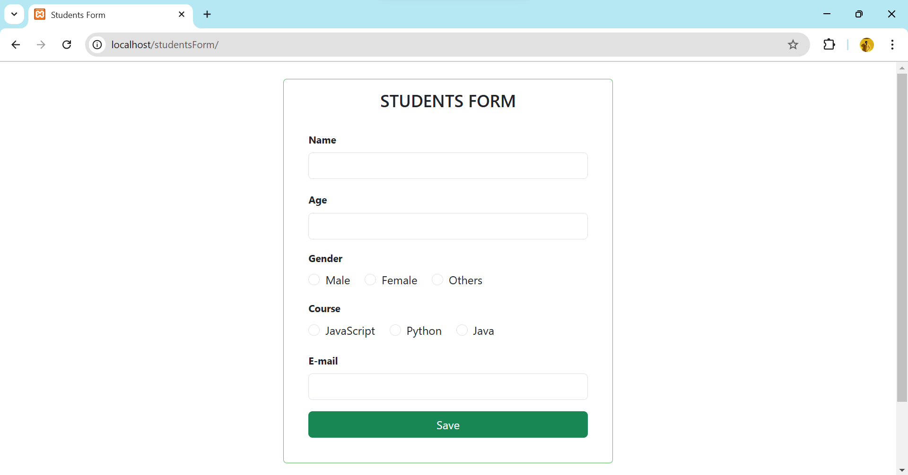
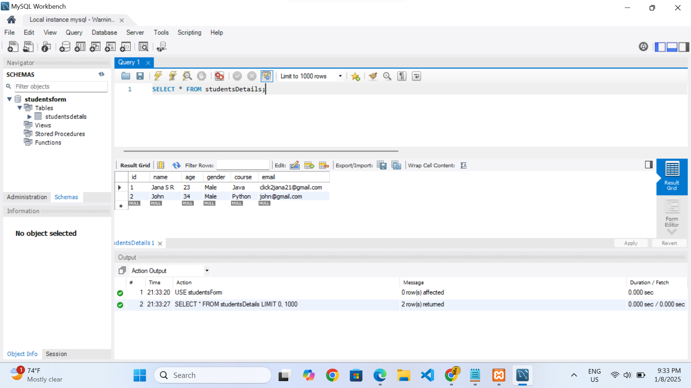

# Student Enrollment Form
```
Technologies Used:
- HTML
- CSS
- JavaScript
- MySQL
- Bootstrap
```

## Run Locally

Create a studentsForm database in MySQL Workbench:

```bash
  CREATE DATABASE studentsForm;
```

Create a studentsDetails table:

```bash
  CREATE TABLE studentsDetails (
    id INT AUTO_INCREMENT PRIMARY KEY,
    name VARCHAR(50) NOT NULL,
    age INT NOT NULL,
    gender VARCHAR(50) NOT NULL,
    course VARCHAR(50) NOT NULL,
    email VARCHAR(50) NOT NULL
);

```

Retrieve All Information from studentsDetails Table:

```bash
  SELECT * FROM studentsDetails;

```

## Main interface



